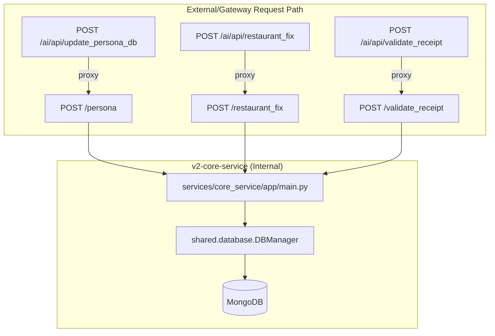
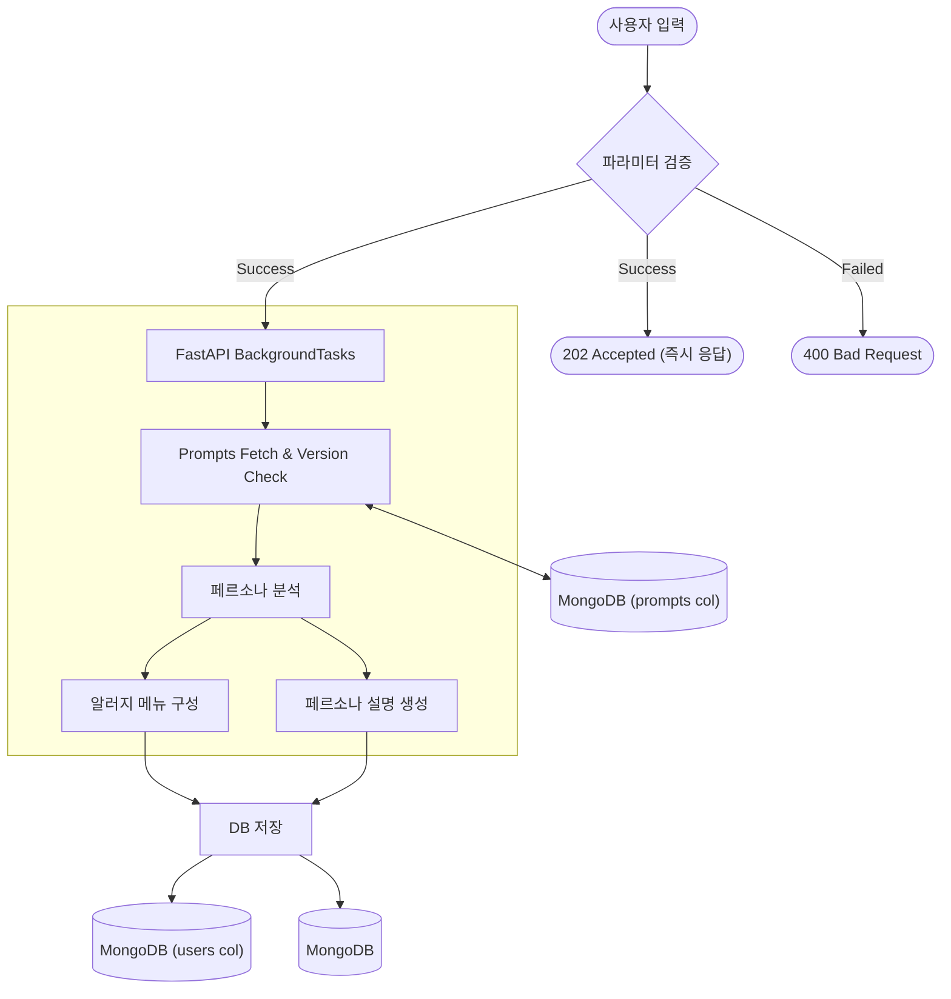

# v2-core-service Architecture

본 문서는 **v2-core-service**의 내부 구조와 책임 범위, 그리고 다루는 데이터 흐름에 대해 설명합니다.

## 1. 서비스 역할 (Role)
**v2-core-service**는 Damo AI Features 서비스의 다음 부분들을 담당합니다.

- **페르소나 업데이트**: 사용자 페르소나에 대한 Create, Update를 수행합니다.
- **회식 장소 확정**: 확정된 회식 장소를 DB에 저장하는 기능을 수행합니다.
- **영수증 OCR**: 영수증 OCR을 통해 실제 방문 여부를 검증합니다.

---

## 2. 내부 구조 (Internal Structure)

---

## 3. 주요 엔드포인트 세부 사항

### 3.1. 페르소나 업데이트 (`/persona`)
사용자의 데이터를 바탕으로 DB를 업데이트합니다.
- **입력**: `UpdatePersonaDBRequest` (사용자 프로필 + 리뷰 목록)
- **응답 정책**: 파라미터 유효성 검증 통과 시 **`202 Accepted`** 즉시 반환 (BackgroundTask 처리)
- **로직**: 
    1. 사용자의 알레르기, 선호도 등 기본 정보 갱신
    2. 리뷰 데이터가 있을 경우 `reviews` 컬렉션에 추가
- **출력**: `UpdatePersonaDBResponse` (요청 접수 완료 상태)

### 3.2. 회식 세션 관리 및 확정 (`/restaurant_fix`)
투표 결과를 바탕으로 특정 회식 세션을 최종 확정하거나 상태를 변경합니다.
- **입력**: `RestaurantFixRequest` (회식 데이터 + 확정 식당 ID + 투표 상세 결과)
- **로직**:
    1. `dining_sessions` 컬렉션에서 해당 세션 조회
    2. 최종 선택된 식당 정보를 업데이트하고 세션 상태를 `isCompleted=True`로 변경
    3. 투표 결과 리스트를 아카이브하여 저장
- **출력**: `RestaurantFixResponse`

---

## 4. 엔드포인트별 세부 아키텍쳐

### 페르소나 업데이트

사용자 입력 데이터를 분석하여 지능형 페르소나를 생성하고 저장하는 상세 흐름입니다. 이 과정은 `v2-shared`의 스케마를 참조하며, 작업 시간이 소요되는 분석 로직은 비동기로 처리됩니다.

**1. BackgroundTask 실행 흐름**
- 클라이언트의 페르소나 업데이트 요청이 들어오면 Pydantic 모델을 통한 **입력 값 검증**을 최우선으로 수행합니다.
- 검증에 문제가 없다면 `FastAPI.BackgroundTasks`에 분석 작업을 등록하고 즉시 `202 Accepted` 응답을 보냅니다.
- **Prompt Management (LLMOps)**: BackgroundTask가 시작되면 외부 스토리지(S3, Git 등)로부터 최신 **Prompt Markdown** 파일을 호출합니다.
  - **영속성 계층 (Persistence)**: 받아온 프롬프트와 버전 정보는 MongoDB의 **`prompts` 컬렉션**에 저장/동기화됩니다.
  - **인스턴스 재시작 대응**: 서버 재시작 시에도 로컬 캐시 대신 MongoDB를 참조하여 콜드 스타트 에러를 방지하고 최신 프롬프트를 즉시 로드합니다.
- 이후 최신화된 프롬프트를 기반으로 분석 작업이 독립적으로 진행됩니다.

**2. AI 분석 재시도 및 실패 처리**
- **재시도 정책**: AI 분석(알러지 메뉴 구성, 페르소나 설명 생성) 호출 실패 시 **최대 3회 고정 재시도**를 수행합니다.
- **최종 실패 시 처리**: 
  - 3회 재시도 후에도 AI 분석에 실패할 경우, 해당 에러 내용을 **USER_DB(사용자 정보 컬렉션)**의 전용 에러 필드에 기록합니다.
  - **(추후 수정)** 기록된 에러 데이터는 추후 별도의 **Cron Job**을 통해 트래픽이 적은 시간에 재진행(Sync)될 수 있도록 설계되었습니다.

**3. 병렬 처리 전략**
- **최초 생성 시**: `알러지 메뉴 구성`과 `페르소나 설명 생성`을 병렬(Parallel)로 처리하여 전체 분석 시간을 단축합니다.
- **업데이트 시**: 기존 알러지 데이터를 재사용하고 `페르소나 설명`만 선택적으로 재생성하여 리소스 소모를 방지합니다.
- 실제 서비스 호출시 비동기 처리(업데이트는 서비스 진행 흐름과 무관)
- 최초 생성/업데이트를 구분해서 선택적으로 병렬 처리를 진행
  - 최초 생성시: 알러지 메뉴 구성, 페르소나 설명 생성 병렬 처리
  - 업데이트시: 페르소나 설명만 재생성