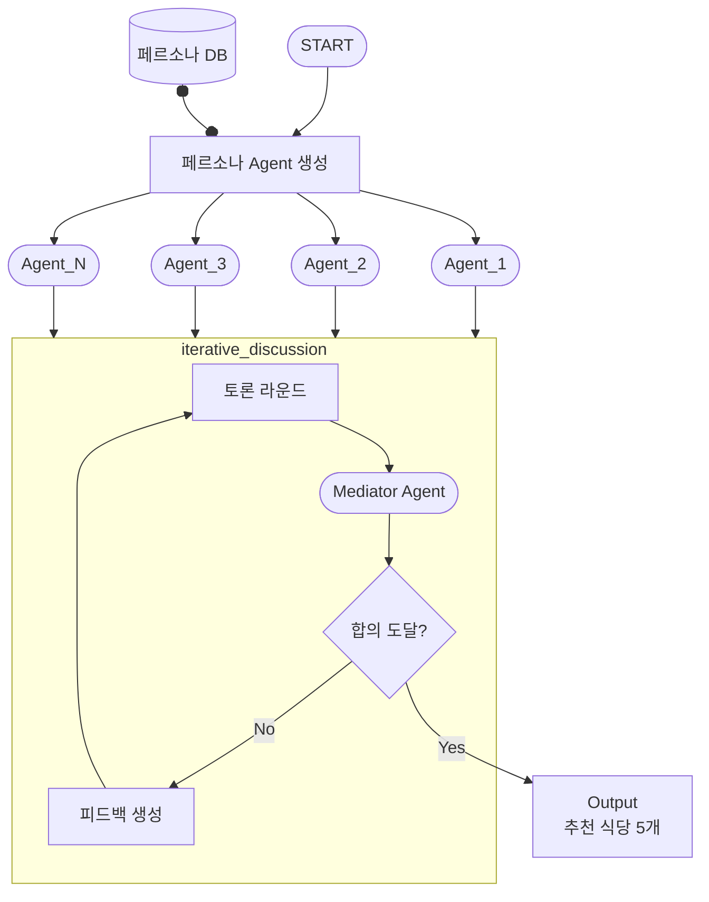

# iterative_discussion 개발 계획

## 📋 목표

**페르소나 에이전트들의 협업적 토론을 통한 식당 추천 시스템 구현**



---

## 🎯 핵심 알고리즘

### 수도 코드

```python
FUNCTION iterative_discussion(agents, candidates, max_rounds):
    discussion_history = []
    
    FOR round = 1 TO max_rounds DO
        # 토론 라운드
        opinions = COLLECT_OPINIONS(agents, candidates, discussion_history)
        UPDATE discussion_history WITH opinions
        
        # 중재 및 합의 확인
        mediator_result = MEDIATOR_EVALUATE(opinions, discussion_history)
        
        IF mediator_result.consensus THEN
            RETURN TOP_N(mediator_result.recommendations, 5)
        END IF
        
        # 피드백 전달
        BROADCAST_FEEDBACK(agents, mediator_result.feedback)
    END FOR
    
    # 합의 실패 시 강제 선택
    RETURN FORCE_SELECT_TOP_5(discussion_history)
END FUNCTION
```

---

## 📊 입력 데이터 형식

### 시나리오 1: 첫 추천 (Cold Start)
```json
{
  "user_ids": ["user_001", "user_002", "user_003"],
  "candidates": [
    {
      "restaurant_id": "rest_001",
      "name": "맛있는 한식당",
      "cuisine": "KOREAN",
      "price_range": "medium",
      "rating": 4.5,
      "location": "강남구"
    }
  ],
  "max_rounds": 5,
  "context": {
    "occasion": "business_lunch",
    "preferences": ["quiet", "parking_available"]
  }
}
```

### 시나리오 2: 피드백 기반 재추천
```json
{
  "user_ids": ["user_001", "user_002", "user_003"],
  "candidates": [...],
  "max_rounds": 5,
  "previous_discussion": {
    "discussion_id": "disc_12345",
    "previous_recommendations": ["rest_001", "rest_002"],
    "user_feedback": {
      "user_001": {
        "rejected": ["rest_001"],
        "reason": "너무 시끄러움",
        "preferred_attributes": ["quiet", "cozy"]
      }
    }
  },
  "context": {...}
}
```

---

## 🎯 개발 순서

### Phase 1: 데이터 스키마 정의 ✅

#### 1.1 입력/출력 스키마
- [ ] **입력 스키마**
  - [ ] `DiscussionRequest` - 기본 요청
  - [ ] `DiscussionWithFeedbackRequest` - 피드백 포함 요청
  - [ ] `Candidate` - 후보 식당 정보
  - [ ] `Context` - 추천 컨텍스트
  - [ ] `UserFeedback` - 사용자 피드백

- [ ] **출력 스키마**
  - [ ] `DiscussionResponse` - 최종 응답
  - [ ] `Recommendation` - 추천 결과
  - [ ] `DiscussionHistory` - 토론 히스토리

#### 1.2 내부 데이터 모델
- [ ] **Agent 관련**
  - [ ] `PersonaAgent` - 페르소나 에이전트
  - [ ] `MediatorAgent` - 중재자 에이전트
  - [ ] `AgentOpinion` - 에이전트 의견

- [ ] **Discussion 관련**
  - [ ] `DiscussionRound` - 토론 라운드
  - [ ] `MediatorResult` - 중재 결과
  - [ ] `ConsensusCheck` - 합의 체크

**파일**:
- `src/features/discussion/schemas/request.py`
- `src/features/discussion/schemas/response.py`
- `src/features/discussion/schemas/agent.py`
- `src/features/discussion/schemas/discussion.py`

---

### Phase 2: Agent 시스템 구현 (TDD)

#### 2.1 Base Agent
- [ ] **테스트 작성**
  - [ ] `tests/unit/features/discussion/agents/test_base_agent.py`

- [ ] **구현**
  - [ ] `src/features/discussion/agents/base_agent.py`
    - [ ] `generate_opinion(candidates, history)` - 의견 생성
    - [ ] `process_feedback(feedback)` - 피드백 처리
    - [ ] `update_state(new_info)` - 상태 업데이트

#### 2.2 Persona Agent
- [ ] **테스트 작성**
  - [ ] `tests/unit/features/discussion/agents/test_persona_agent.py`

- [ ] **구현**
  - [ ] `src/features/discussion/agents/persona_agent.py`
    - [ ] `__init__(persona_data)` - 페르소나 기반 초기화
    - [ ] `generate_opinion()` - 페르소나 특성 반영 의견
    - [ ] `rank_candidates()` - 후보 순위 매기기
    - [ ] `explain_preference()` - 선호 이유 설명

**LLM 프롬프트**:
- [ ] `src/features/discussion/prompts/persona_opinion.py`
  - [ ] 페르소나 특성 기반 의견 생성 프롬프트
  - [ ] 피드백 반영 프롬프트

#### 2.3 Mediator Agent
- [ ] **테스트 작성**
  - [ ] `tests/unit/features/discussion/agents/test_mediator_agent.py`

- [ ] **구현**
  - [ ] `src/features/discussion/agents/mediator_agent.py`
    - [ ] `evaluate_opinions(opinions)` - 의견 평가
    - [ ] `check_consensus(opinions)` - 합의 확인
    - [ ] `generate_feedback(opinions)` - 피드백 생성
    - [ ] `select_top_n(opinions, n=5)` - 상위 N개 선택

**합의 판단 로직**:
```python
def check_consensus(opinions):
    # 1. 상위 5개 식당에 대한 중복도 계산
    # 2. 중복도 >= 80% → 합의 도달
    # 3. 의견 분산도 < 0.3 → 합의 도달
    pass
```

**LLM 프롬프트**:
- [ ] `src/features/discussion/prompts/mediator_evaluation.py`
  - [ ] 의견 평가 프롬프트
  - [ ] 합의 판단 프롬프트
  - [ ] 피드백 생성 프롬프트

---

### Phase 3: Repository 계층 (TDD)

#### 3.1 Persona Repository
- [ ] **테스트 작성**
  - [ ] `tests/unit/features/discussion/repositories/test_persona_repository.py`

- [ ] **구현**
  - [ ] `src/features/discussion/repositories/persona_repository.py`
    - [ ] `get_personas_by_user_ids(user_ids)` - 여러 페르소나 조회
    - [ ] `get_persona(user_id)` - 단일 페르소나 조회

#### 3.2 Discussion Repository
- [ ] **테스트 작성**
  - [ ] `tests/unit/features/discussion/repositories/test_discussion_repository.py`

- [ ] **구현**
  - [ ] `src/features/discussion/repositories/discussion_repository.py`
    - [ ] `save_discussion(discussion)` - 토론 저장
    - [ ] `get_discussion(discussion_id)` - 토론 조회
    - [ ] `update_discussion(discussion_id, data)` - 토론 업데이트

**저장 방식**: JSON 파일 기반 (개발 단계)
- 경로: `data/discussions/{discussion_id}.json`

---

### Phase 4: Service 계층 (TDD)

#### 4.1 Agent Service
- [ ] **테스트 작성**
  - [ ] `tests/unit/features/discussion/services/test_agent_service.py`

- [ ] **구현**
  - [ ] `src/features/discussion/services/agent_service.py`
    - [ ] `create_agents(user_ids)` - 페르소나로부터 에이전트 생성
    - [ ] `initialize_agents(personas)` - 에이전트 초기화
    - [ ] `collect_opinions(agents, candidates, history)` - 의견 수집

#### 4.2 Discussion Service
- [ ] **테스트 작성**
  - [ ] `tests/unit/features/discussion/services/test_discussion_service.py`

- [ ] **구현**
  - [ ] `src/features/discussion/services/discussion_service.py`
    - [ ] `run_discussion_round(agents, candidates, history)` - 토론 라운드 실행
    - [ ] `broadcast_feedback(agents, feedback)` - 피드백 전달
    - [ ] `format_history(rounds)` - 히스토리 포맷팅

#### 4.3 Mediator Service
- [ ] **테스트 작성**
  - [ ] `tests/unit/features/discussion/services/test_mediator_service.py`

- [ ] **구현**
  - [ ] `src/features/discussion/services/mediator_service.py`
    - [ ] `evaluate_round(opinions, history)` - 라운드 평가
    - [ ] `determine_consensus(evaluation)` - 합의 판단
    - [ ] `force_select_top_5(history)` - 강제 선택 (max_rounds 도달 시)

---

### Phase 5: LangGraph 워크플로우 (TDD)

#### 5.1 State 정의
- [ ] **테스트 작성**
  - [ ] `tests/unit/features/discussion/graphs/states/test_discussion_state.py`

- [ ] **구현**
  - [ ] `src/features/discussion/graphs/states/discussion_state.py`

```python
class DiscussionState(TypedDict):
    # 입력
    user_ids: List[str]
    candidates: List[dict]
    max_rounds: int
    context: Optional[dict]
    previous_discussion: Optional[dict]
    
    # 실행 상태
    current_round: int
    agents: List[PersonaAgent]
    mediator: MediatorAgent
    
    # 토론 데이터
    discussion_history: List[DiscussionRound]
    current_opinions: List[AgentOpinion]
    mediator_result: Optional[MediatorResult]
    
    # 출력
    final_recommendations: Optional[List[Recommendation]]
    consensus_reached: bool
    
    # 에러
    error: Optional[str]
```

#### 5.2 Node 구현

##### 5.2.1 Agent Creator Node
- [ ] **테스트**: `tests/unit/features/discussion/graphs/nodes/test_agent_creator.py`
- [ ] **구현**: `src/features/discussion/graphs/nodes/agent_creator.py`
  - [ ] 페르소나 조회
  - [ ] PersonaAgent 생성
  - [ ] MediatorAgent 생성
  - [ ] 이전 피드백 로드 (재추천 시)

##### 5.2.2 Discussion Round Node
- [ ] **테스트**: `tests/unit/features/discussion/graphs/nodes/test_discussion_round.py`
- [ ] **구현**: `src/features/discussion/graphs/nodes/discussion_round.py`
  - [ ] 각 에이전트로부터 의견 수집
  - [ ] 의견을 discussion_history에 추가
  - [ ] current_round 증가

##### 5.2.3 Mediator Node
- [ ] **테스트**: `tests/unit/features/discussion/graphs/nodes/test_mediator.py`
- [ ] **구현**: `src/features/discussion/graphs/nodes/mediator.py`
  - [ ] 의견 평가
  - [ ] 합의 확인
  - [ ] 피드백 생성 (합의 미달 시)
  - [ ] 상위 5개 선택 (합의 도달 시)

##### 5.2.4 Consensus Checker Node
- [ ] **테스트**: `tests/unit/features/discussion/graphs/nodes/test_consensus_checker.py`
- [ ] **구현**: `src/features/discussion/graphs/nodes/consensus_checker.py`
  - [ ] 합의 도달 여부 확인
  - [ ] max_rounds 도달 여부 확인
  - [ ] 다음 액션 결정 (계속/종료)

#### 5.3 Graph 조립
- [ ] **테스트**: `tests/integration/features/discussion/test_discussion_graph.py`
- [ ] **구현**: `src/features/discussion/graphs/discussion_graph.py`

```python
# Graph 구조
graph = StateGraph(DiscussionState)

# 노드 추가
graph.add_node("agent_creator", agent_creator_node)
graph.add_node("discussion_round", discussion_round_node)
graph.add_node("mediator", mediator_node)
graph.add_node("consensus_checker", consensus_checker_node)

# 엣지 연결
graph.add_edge(START, "agent_creator")
graph.add_edge("agent_creator", "discussion_round")
graph.add_edge("discussion_round", "mediator")
graph.add_edge("mediator", "consensus_checker")

# 조건부 엣지
graph.add_conditional_edges(
    "consensus_checker",
    should_continue,
    {
        "continue": "discussion_round",  # 합의 미달 → 다음 라운드
        "end": END                        # 합의 도달 or max_rounds
    }
)
```

---

### Phase 6: API 엔드포인트 (TDD)

#### 6.1 API Routes
- [ ] **테스트**: `tests/integration/features/discussion/test_api_endpoints.py`
- [ ] **구현**: `src/features/discussion/api/routes.py`

**엔드포인트**:
- [ ] `POST /discussion/recommend` - 첫 추천 시작
- [ ] `POST /discussion/recommend-with-feedback` - 피드백 기반 재추천
- [ ] `GET /discussion/{discussion_id}` - 토론 상태 조회
- [ ] `GET /discussion/{discussion_id}/history` - 토론 히스토리 조회

#### 6.2 Request/Response 예시

**POST /discussion/recommend**
```json
{
  "user_ids": ["user_001", "user_002"],
  "candidates": [...],
  "max_rounds": 5,
  "context": {
    "occasion": "business_lunch"
  }
}
```

**Response**
```json
{
  "discussion_id": "disc_12345",
  "recommendations": [
    {
      "restaurant_id": "rest_001",
      "name": "맛있는 한식당",
      "score": 0.95,
      "consensus_level": "high",
      "supporting_agents": ["user_001", "user_002"],
      "reasons": [
        "user_001: 한식을 선호하며 조용한 분위기",
        "user_002: 가격대가 적절하고 주차 가능"
      ]
    }
  ],
  "consensus_reached": true,
  "total_rounds": 3,
  "discussion_summary": "3라운드 만에 합의 도달"
}
```

---

### Phase 7: 통합 테스트

#### 7.1 End-to-End 테스트
- [ ] **파일**: `tests/integration/features/discussion/test_end_to_end.py`

**시나리오**:
- [ ] 첫 추천 플로우 (Cold Start)
- [ ] 피드백 기반 재추천 플로우
- [ ] 합의 도달 시나리오
- [ ] 합의 실패 시나리오 (max_rounds 도달)
- [ ] 에러 처리 (페르소나 없음, 후보 없음)

#### 7.2 성능 테스트
- [ ] **파일**: `tests/performance/test_discussion_performance.py`

**테스트 항목**:
- [ ] 다수 에이전트 처리 (10명)
- [ ] 다수 후보 처리 (100개)
- [ ] 라운드 수에 따른 응답 시간

---

## 📁 프로젝트 구조

```
iterative_discussion/
├── data/
│   └── discussions/              # 토론 히스토리 저장
│       └── {discussion_id}.json
│
├── src/features/discussion/
│   ├── schemas/
│   │   ├── request.py           # 입력 스키마
│   │   ├── response.py          # 출력 스키마
│   │   ├── agent.py             # 에이전트 스키마
│   │   └── discussion.py        # 토론 스키마
│   │
│   ├── agents/
│   │   ├── base_agent.py        # Base Agent
│   │   ├── persona_agent.py     # Persona Agent
│   │   └── mediator_agent.py    # Mediator Agent
│   │
│   ├── prompts/
│   │   ├── persona_opinion.py   # 페르소나 의견 프롬프트
│   │   └── mediator_evaluation.py # 중재자 평가 프롬프트
│   │
│   ├── repositories/
│   │   ├── persona_repository.py
│   │   └── discussion_repository.py
│   │
│   ├── services/
│   │   ├── agent_service.py
│   │   ├── discussion_service.py
│   │   └── mediator_service.py
│   │
│   ├── graphs/
│   │   ├── states/
│   │   │   └── discussion_state.py
│   │   ├── nodes/
│   │   │   ├── agent_creator.py
│   │   │   ├── discussion_round.py
│   │   │   ├── mediator.py
│   │   │   └── consensus_checker.py
│   │   └── discussion_graph.py
│   │
│   └── api/
│       └── routes.py
│
└── tests/
    ├── unit/features/discussion/
    │   ├── agents/
    │   ├── services/
    │   ├── repositories/
    │   └── graphs/
    └── integration/features/discussion/
```

---

## 📊 진행 상황

- ⏳ **Phase 1**: 데이터 스키마 정의
- ⏳ **Phase 2**: Agent 시스템 구현
- ⏳ **Phase 3**: Repository 계층
- ⏳ **Phase 4**: Service 계층
- ⏳ **Phase 5**: LangGraph 워크플로우
- ⏳ **Phase 6**: API 엔드포인트
- ⏳ **Phase 7**: 통합 테스트

**총 테스트**: 0 passed (시작 전)

---

## ✅ 다음 단계

### 1단계: 환경 준비
```bash
# 디렉토리 생성
mkdir -p src/features/discussion/{schemas,agents,prompts,repositories,services,graphs/{states,nodes},api}
mkdir -p tests/unit/features/discussion/{agents,services,repositories,graphs/{states,nodes}}
mkdir -p tests/integration/features/discussion
mkdir -p data/discussions
```

### 2단계: Phase 1 시작 - 스키마 정의
- 입력/출력 스키마 작성
- 내부 데이터 모델 정의
- Pydantic 모델 구현

### 3단계: Phase 2 - Agent 시스템 (TDD)
- BaseAgent 테스트 및 구현
- PersonaAgent 테스트 및 구현
- MediatorAgent 테스트 및 구현

**예상 소요 시간**: 3-5일  
**완료 후**: make_persona와 통합 테스트

---

**작성일**: 2026-01-25  
**최종 업데이트**: 2026-01-25 23:19  
**버전**: 1.0.0
