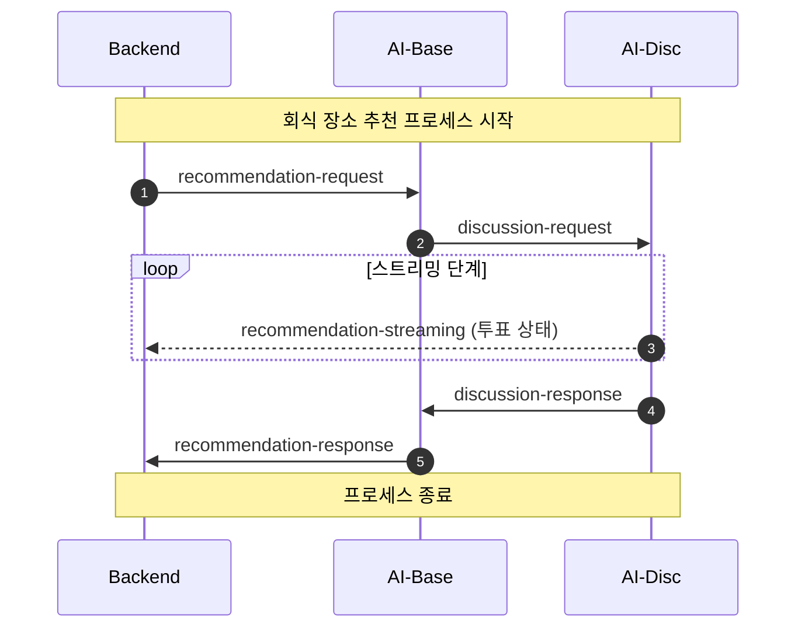
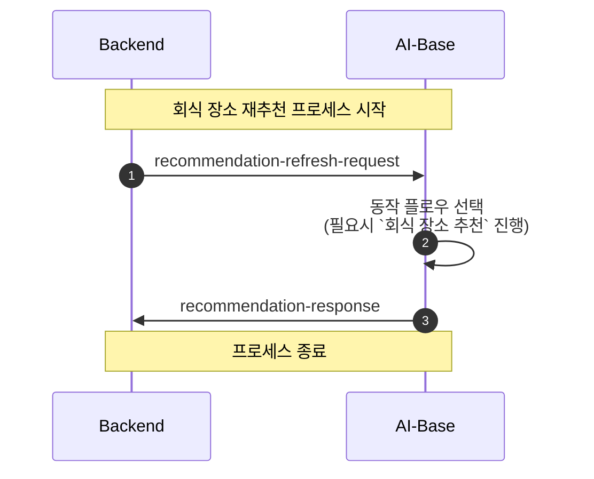
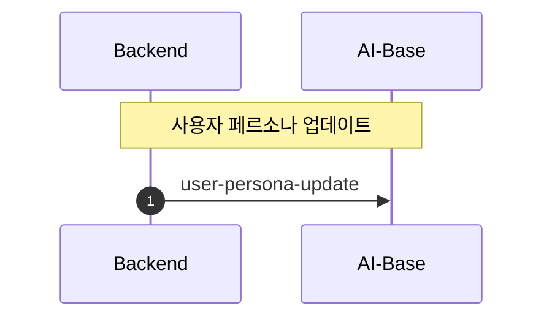
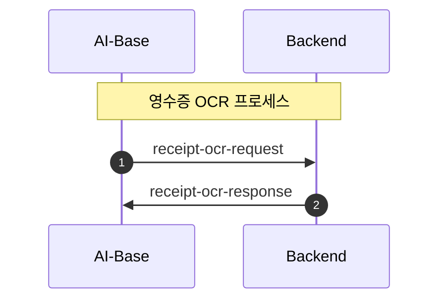

### Kafka 메시지 채널

1. 여러 개의 토픽을 사용하고 있기 때문에 각 토픽에 대한 연결 구성을 해당 업무 관련자들이 정확하게 파악할 필요가 있음
2. 이 파일은 BE, AI 간의 Kafka 통신에 대한 Producer, Consumer 연결 및 payload에 대한 정보를 담고 있음

---

### Kafka 토픽

| 토픽명 | 설명 | Producer | Consumer |
| :--- | :--- | :--- | :--- |
| `recommendation-request` | 회식 장소 추천 | BE | AI-Base |
| `recommendation-response` | 회식 장소 추천 결과 | AI-Base | BE |
| `recommendation-streaming` | 페르소나 투표 상태 스트리밍 | AI-Disc | BE |
| `recommendation-refresh-request` | 회식 장소 재추천 | BE | AI-Base |
| `user-persona-update` | 페르소나 업데이트 | BE | AI-Base |
| `receipt-ocr-request` | 영수증 OCR 요청 | AI-Base | BE |
| `receipt-ocr-response` | 영수증 OCR 결과 | BE | AI-Base |
| `discussion-request` | 페르소나 대화 요청 | AI-Base | AI-Disc |
| `discussion-response` | 페르소나 대화 결과 | AI-Disc | AI-Base |

---

### Kafka 토픽간 메시지 연결
1. 회식 장소 추천(초기 상태)
    - BE가 `recommendation-request` 토픽에 메시지를 보내면서 Task 시작
    - AI-Base가 `recommendation-request` 메시지를 받고 `discussion-request` 토픽에 메시지를 보냄
    - AI-Disc가 `discussion-request` 메시지를 받고 `recommendation-streaming` 토픽에 메시지를 보냄
    - 모든 상태가 완료되면 AI-Disc가 `discussion-response` 토픽에 메시지를 보냄
    - AI-Base가 `discussion-response` 메시지를 받고 `recommendation-response` 토픽에 메시지를 보냄
    - BE가 `recommendation-response` 메시지를 받으면 Task 종료

2. 회식 장소 재추천(초기 상태)
    - BE가 `recommendation-refresh-request` 토픽에 메시지를 보내면서 Task 시작
    - AI-Base가 `recommendation-refresh-request` 메시지를 받고 동작 플로우를 선택
    - 동작 플로우에 따라 `회식 장소 추천` 또는 `recommendation-response` 로 플로우 진행

3. 사용자 페르소나 업데이트
    - BE가 `user-persona-update` 토픽에 메시지를 보내면서 Task 시작
    - AI-Base가 메시지를 수신하여 사용자 맞춤형 추천을 위한 페르소나 정보를 반영
    - 별도의 응답 없이 프로세스 종료

4. 영수증 OCR (AI-Base 요청)
    - BE가 `receipt-ocr-request` 토픽에 메시지를 보내면서 Task 시작
    - AI-Base가 `receipt-ocr-request` 메시지를 수신하여 영수증 이미지를 분석하여 텍스트 데이터 추출 (OCR 처리)
    - AI-Base가 `receipt-ocr-response` 메시지를 전송
    - BE가 `receipt-ocr-response` 메시지를 수신하여 Task 종료

