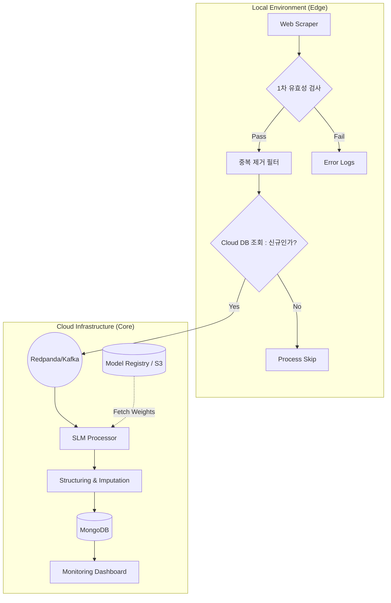

# 🚀 SLM 기반 중복 제거 & 데이터 파이프라인 프로젝트

본 프로젝트는 비정형 데이터를 효율적으로 수집하여 정형 데이터로 변환하고, 비용 최적화를 위해 **중복 제거 시스템**과 **Modular SLM(LLMOps)** 구조를 결합한 데이터 파이프라인 구축을 목표로 합니다.

---

### 🏗️ 시스템 아키텍처

### 1단계: Local Ingestion (Edge Collection)
- **Scraper:** 로컬에서 약 4,000건의 비정형 데이터 수집.
- **Pre-Filtering:** 클라우드 리소스 사용 전, 빈 데이터나 오류 데이터를 로컬에서 1차 제거.

### 2단계: Intelligent Ingestion (Cost Optimization)
- **Deduplication:** 클라우드 MongoDB의 인덱스를 조회하여 이미 존재하는 데이터인 경우 클라우드 전송 단계에서 차단.
- **Cloud Entry:** 신규 데이터만 클라우드 상의 **Redpanda/Kafka** 토픽으로 전송.

### 3단계: SLM Transformation (LLMOps)
- **Cloud Processing:** 클라우드에 상주하거나 필요시 기동되는 SLM Processor가 Kafka 메시지를 소비.
- **Modular Design:** 외부 가중치를 로드하여 최신 파인튜닝 모델을 유연하게 적용.
- **Structuring:** 비정형 텍스트를 정형 JSON으로 변환 및 필드 보정.

### 4단계: Final Storage & Monitoring
- **MongoDB:** 최종 처리 결과를 저장.
- **Dashboard:** 전체 파이프라인의 처리량, 중복 제거율, 비용 절감 지표 시각화.

---

## 📊 프로젝트 로드맵

### Phase 1: Infrastructure & Skeleton (P0)
- Docker Compose 기반 인프라 구축 (MongoDB, Redpanda/Kafka).
- 프로젝트 기본 폴더 구조 및 공유 라이브러리 설계.

### Phase 2: Local Scraper (P0)
- Python 기반 스크래퍼 및 데이터 유효성 검사 로직 구현.

### Phase 3: Pre-Processing Pipeline (P1)
- DB 연동 중복 제거 로직 개발.
- Kafka Producer/Consumer 연동.

### Phase 4: Modular SLM Worker (P1)
- SLM 추론 엔진 구현.
- 외부 가중치 로드 및 Field Imputation 로직 완성.

### Phase 5: Monitoring & Optimization (P2)
- 파이프라인 처리량 및 비용 절감 지표 모니터링.
- 최종 통합 테스트 및 중복 제거 성능 검증.

---

## 🛠️ 기술 스택
- **Language:** Python 3.10+
- **Infrastructure:** Docker, Redpanda (Kafka-compatible), MongoDB
- **Processing:** Celery (Optional), Pydantic
- **AI/ML:** HuggingFace Transformers, Ollama/vLLM (SLM Inference)
- **Scraping:** Playwright or BeautifulSoup

---

## 💡 주요 특징 (Key Highlights)
1. **Deduplication First:** 비싼 SLM을 돌리기 전 중복을 먼저 걸러내어 비용 극대화.
2. **LLMOps Architecture:** 코드와 모델 파라미터를 분리하여 유연한 모델 교체 가능.
3. **Hybrid Cloud:** 수집은 로컬에서, 무거운 처리는 클라우드에서 수행하는 하이브리드 전략.
