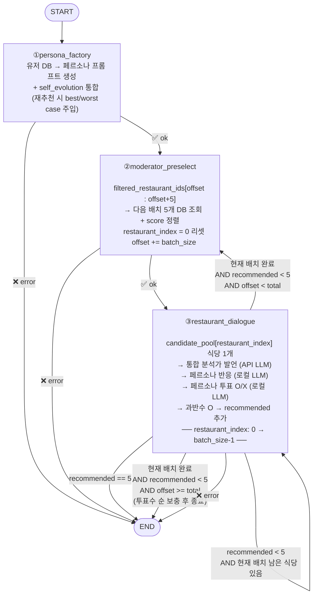

# agent_dialogue 서비스 설계 문서

## 1. 개요

`iterative_discussion`의 한계:
- 페르소나가 10개 식당을 한꺼번에 보고 감으로 판단 → 발언 분산, 합의 불안정
- 근거 없는 선호 표현 반복으로 라운드가 수렴하지 않음

`agent_dialogue` 개선 방향:
- 식당을 1개씩 순서대로 발표
- 통합 분석가가 해당 식당 데이터 기반 분석 발언
- 페르소나가 분석 내용에 반응 후 O/X 투표
- 과반수 찬성 식당만 추천 리스트에 추가 → 5개 채우면 종료
- 배치(5개) 단위로 가져오며 부족하면 추가 fetch

---

## 2. 전체 플로우

```
① persona_factory   — 유저 DB 조회 → 페르소나 프롬프트 생성
                       + self_evolution 통합 (재추천 시 best/worst case 주입)
② moderator_preselect — filtered_restaurant_ids에서 배치 5개 DB 조회 + score 정렬
③ restaurant_dialogue — 식당 1개씩 순서대로
                         → 통합 분석가 발언 (API LLM)
                         → 페르소나 반응 (로컬 LLM)
                         → 페르소나 투표 O/X (로컬 LLM)
                         → 과반수 O → recommended_restaurants 추가
                         → recommended == 5 또는 배치 소진 시 분기
```

---

## 3. 그래프 다이어그램



---

## 4. 재사용 코드 목록

| 파일 | 원본 경로 | 처리 방법 |
|---|---|---|
| `engine/llm_factory.py` | `iterative_discussion/app/engine/llm_factory.py` | 그대로 복사 |
| `utils/scoring.py` | `iterative_discussion/app/utils/scoring.py` | 그대로 복사 |
| `utils/monitoring.py` | `iterative_discussion/app/utils/monitoring.py` | 그대로 복사 |
| `utils/logging_config.py` | `iterative_discussion/app/utils/logging_config.py` | 그대로 복사 |
| `nodes/moderator_preselect.py` | `iterative_discussion/app/nodes/moderator_preselect.py` | import 변경 + batch/offset 로직 추가 |
| `nodes/persona_factory.py` | `iterative_discussion/app/nodes/persona_factory.py` | import 변경 + self_evolution 로직 통합 |
| `prompts/persona_templates.py` | `iterative_discussion/app/prompts/persona_templates.py` | 그대로 복사 |
| `prompts/langfuse_prompts.py` | `iterative_discussion/app/prompts/langfuse_prompts.py` | 그대로 복사 |

**제거된 노드 (기존 대비):**
- `self_evolution` → `persona_factory`에 통합
- `analyst_dialogue` / `free_dialogue` / `restaurant_selector` / `persona_voting` → `restaurant_dialogue` 1개로 대체

---

## 5. State 설계 (`engine/state.py`)

```python
class AgentDialogueState(TypedDict):
    # ── 입력 ───────────────────────────────────────────────────────────
    user_ids: List[int]
    user_data_list: List[Dict[str, Any]]
    dining_data: Dict[str, Any]
    filtered_restaurant_ids: List[str]   # 전체 후보 ID 목록 (외부 입력)
    vote_result_list: List[Dict[str, Any]]  # 재추천 시 thumbup/thumbdown

    # ── Node 1: persona_factory ────────────────────────────────────────
    persona_prompts: Dict[str, str]      # user_id → system prompt

    # ── Node 2: moderator_preselect ────────────────────────────────────
    candidate_pool: List[Dict[str, Any]] # 현재 배치 식당 (최대 5개, score 포함)
    restaurant_offset: int               # filtered_restaurant_ids에서 다음 fetch 시작 위치

    # ── Node 3: restaurant_dialogue ────────────────────────────────────
    restaurant_index: int                # 현재 배치 내 처리 중인 인덱스 (0 ~ batch_size-1)
    dialogue_history: List[Dict[str, Any]]  # 전체 대화 기록 (분석가 + 반응 + 투표)
    recommended_restaurants: List[Dict[str, Any]]  # 과반수 통과 식당 (최대 5개)
    processed_restaurants: List[Dict[str, Any]]    # 투표 완료된 모든 식당 (fallback용)

    # ── 최종 출력 ──────────────────────────────────────────────────────
    final_selection: List[Dict[str, Any]]  # 최종 Top 5 (main.py에서 confirmed)
    persona_votes: List[Dict[str, Any]]    # 전체 투표 기록 (self_evolution 저장용)

    # ── 에러 처리 ──────────────────────────────────────────────────────
    is_error: bool
    error_message: str
```

**설계 결정 사항:**
- `restaurant_offset`: 배치 완료 후 `moderator_preselect`로 루프백 시 다음 시작 위치
- `processed_restaurants`: fallback 시 찬성수 기준 보충에 사용
- `persona_votes`: restaurant-centric 포맷으로 누적. `main.py`에서 user-centric으로 변환 후 DB 저장

---

## 6. Node 상세 설계

### Node 1: `persona_factory.py` (self_evolution 통합)

**처리 순서:**
1. `user_ids`로 users DB 조회 → `user_data_list`
2. 각 유저의 페르소나 system prompt 생성 (`vote_feedback=""` 초기값)
3. `vote_result_list`가 있으면 (재추천):
   - `dining_sessions` DB 조회 → 이전 가상투표 조회
   - 예측 vs 실제 비교 → best_case / worst_case 텍스트 생성
   - 각 페르소나 프롬프트의 `{vote_feedback}` 자리에 주입

---

### Node 2: `moderator_preselect.py` (batch/offset 추가)

**처리 순서:**
1. `restaurant_offset`부터 최대 5개 ID 슬라이싱: `filtered_restaurant_ids[offset : offset+5]`
2. DB에서 해당 식당 문서 조회
3. `rank_restaurants()`로 score 정렬
4. `restaurant_offset += len(batch)`, `restaurant_index = 0` 리셋 반환

---

### Node 3: `restaurant_dialogue.py` (핵심 신규)

**처리 순서 (식당 1개 기준):**
1. `candidate_pool[restaurant_index]`로 현재 식당 결정
2. 해당 식당 데이터 포맷 (menus, price, amenities, keywords, distance 등 전체 포함)
3. **통합 분석가 발언** (API LLM, temperature=0.3):
   - system: 통합 분석가 페르소나 (알레르기·메뉴·가격·편의·거리 종합)
   - user: 식당 데이터 + 회식 정보 + 참여자 알레르기
4. **페르소나 반응** (로컬 LLM, temperature=0.7):
   - 각 페르소나가 분석가 발언에 순차 반응
   - 컨텍스트: 분석가 발언 + 앞선 페르소나 반응 (이전 식당 대화 제외)
5. **페르소나 투표** (로컬 LLM, temperature=0.0):
   - 각 페르소나가 분석가 발언 + 반응 전체를 보고 O/X + 사유
   - 과반수(> N/2) 찬성이면 `recommended_restaurants`에 추가
6. 투표 결과를 `processed_restaurants`와 `persona_votes`에 누적
7. `restaurant_index += 1` 반환

**`dialogue_history` 엔트리 포맷:**
```python
# 분석가 발언
{
    "type": "analyst",
    "restaurant_id": "...",
    "place_name": "...",
    "content": "종합 분석 내용...",
}

# 페르소나 반응
{
    "type": "reaction",
    "restaurant_id": "...",
    "user_id": "1",
    "nickname": "철수",
    "content": "반응 내용...",
}

# 페르소나 투표
{
    "type": "vote",
    "restaurant_id": "...",
    "user_id": "1",
    "nickname": "철수",
    "approve": True,
    "reasoning": "이유...",
}
```

**`processed_restaurants` 엔트리 포맷 (fallback용):**
```python
{
    "restaurant_id": "...",
    "place_name": "...",
    "approve_count": 3,
    "total_count": 4,
    "score": 0.75,  # candidate_pool의 초기 score
}
```

**fallback (5개 미만 시):**
```python
# recommended_restaurants로 부족분 보충
# processed_restaurants를 approve_count 내림차순 → score 내림차순으로 정렬
# recommended에 없는 것 중 상위 N개 추가
```

---

## 7. 그래프 조건부 엣지 (`engine/graph.py`)

```python
def _check_error(state) -> str:
    return "end" if state.get("is_error") else "continue"

def _after_restaurant_dialogue(state) -> str:
    if state.get("is_error"):
        return "end"

    # 5개 채움 → 종료
    if len(state["recommended_restaurants"]) >= 5:
        return "end"

    # 현재 배치에 남은 식당 → 계속
    if state["restaurant_index"] < len(state["candidate_pool"]):
        return "restaurant"

    # 배치 완료 + 추가 ID 있음 → 다음 배치 fetch
    offset = state.get("restaurant_offset", 0)
    total = len(state.get("filtered_restaurant_ids", []))
    if offset < total:
        return "preselect"

    # 모두 소진 → fallback 후 종료
    return "end"
```

---

## 8. 프롬프트 설계 (`prompts/`)

모든 프롬프트는 **Langfuse에서 버저닝 관리**, 로컬 상수를 fallback으로 유지.

### Langfuse 프롬프트 목록

| Langfuse 이름 | 타입 | fallback 상수 | 사용 노드 | 변수 |
|---|---|---|---|---|
| `persona-system-prompt` | **text** | `PERSONA_SYSTEM_PROMPT` | `persona_factory` | `nickname`, `base_persona`, `allergies`, `vote_feedback` |
| `restaurant-analyst-speak` | **text** | `ANALYST_SPEAK_PROMPT` | `restaurant_dialogue` | `restaurant_info`, `dining_info`, `allergy_info` |
| `restaurant-persona-react` | **chat** | `PERSONA_REACT_CHAT_FALLBACK` | `restaurant_dialogue` | `analyst_speech`, `previous_reactions` |
| `restaurant-persona-vote` | **chat** | `PERSONA_VOTE_CHAT_FALLBACK` | `restaurant_dialogue` | `analyst_speech`, `all_reactions` |

### `restaurant_templates.py`

```python
# ── 통합 분석가 발언 (text 타입) ─────────────────────────────────────────────
ANALYST_SPEAK_PROMPT = """\
아래 식당 1곳에 대한 종합 분석을 해주세요.

## 회식 정보
{dining_info}

## 참여자 알레르기
{allergy_info}

## 식당 정보
{restaurant_info}

알레르기 위험, 메뉴 다양성, 가격 적합성, 편의시설, 거리를 종합하여
3~5문장으로 분석해주세요.
"""

ANALYST_SYSTEM_PROMPT = """\
당신은 회식 장소 선정 전문 분석가입니다.
주어진 식당 데이터를 바탕으로 알레르기 위험, 메뉴 구성, 가격 적합성,
편의시설, 이동 거리를 종합적으로 분석합니다.
반드시 데이터에 근거하여 발언하세요.
"""

# ── 페르소나 반응 (chat 타입) ──────────────────────────────────────────────
PERSONA_REACT_CHAT_FALLBACK = [
    {
        "role": "user",
        "content": (
            "분석가 의견:\n{analyst_speech}\n\n"
            "{previous_reactions}"
            "위 분석을 읽고 짧게 반응해주세요. (60자 이내)"
        ),
    }
]

# ── 페르소나 투표 (chat 타입) ──────────────────────────────────────────────
PERSONA_VOTE_CHAT_FALLBACK = [
    {
        "role": "user",
        "content": (
            "분석가 의견:\n{analyst_speech}\n\n"
            "참여자 반응:\n{all_reactions}\n\n"
            "이 식당을 회식 장소로 추천하시겠습니까?\n"
            "반드시 아래 JSON 형식으로만 응답하세요.\n\n"
            '```json\n{{"approve": true/false, "reasoning": "사유 (30자 이내)"}}\n```'
        ),
    }
]
```

---

## 9. `main.py` 변경 사항

`iterative_discussion/app/main.py` 기반으로 수정:
- `build_consensus_graph()` → `build_agent_dialogue_graph()`
- `create_initial_state()` 파라미터 변경 (max_rounds 등 제거)
- `final_selection`: `recommended_restaurants` 기반 (fallback 처리 포함)
- `persona_votes` 변환: restaurant-centric → user-centric 후 DB 저장
- streaming 콜백: `type == "analyst"` → `st.info()`, `type == "vote"` → 투표 결과 렌더링

---

## 10. `streamlit_app.py` 차이점

`iterative_discussion`의 streamlit app 대비:
- 사이드바: `max_rounds` 파라미터 제거
- `restaurant_dialogue` 노드 렌더링:
  - 분석가 발언: `st.info(f"🔍 [{place_name}] {content}")`
  - 페르소나 반응: `chat_message()`
  - 투표 결과: `st.success` (추천) / `st.warning` (미추천)
- 최종 결과: `recommended_restaurants` 테이블

---

## 11. 폴더 구조

```
services/agent_dialogue/
├── DESIGN.md
├── IMPLEMENTATION.md
├── app/
│   ├── __init__.py
│   ├── main.py
│   ├── engine/
│   │   ├── __init__.py
│   │   ├── graph.py
│   │   ├── state.py
│   │   └── llm_factory.py            # 복사
│   ├── nodes/
│   │   ├── __init__.py
│   │   ├── persona_factory.py        # 복사 + self_evolution 통합
│   │   ├── moderator_preselect.py    # 복사 + batch/offset 추가
│   │   └── restaurant_dialogue.py   # 🆕 핵심 노드
│   ├── prompts/
│   │   ├── __init__.py
│   │   ├── restaurant_templates.py  # 🆕 분석가 + 반응 + 투표 프롬프트
│   │   ├── persona_templates.py     # 복사
│   │   └── langfuse_prompts.py      # 복사
│   └── utils/
│       ├── __init__.py
│       ├── scoring.py               # 복사
│       ├── monitoring.py            # 복사
│       └── logging_config.py        # 복사
└── streamlit_app.py
```

총 파일 수: 16개 (신규 4 / 복사 6 / 수정 3 / 진입점 3)
