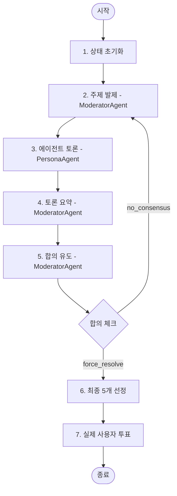

# 멀티에이전트 토론 시스템 (Iterative Discussion)

MULTI_AGENT_DESIGN_DOC.md를 기반으로 구현된 LangGraph 멀티에이전트 협상 시스템입니다.

## 📋 개요

여러 페르소나(Agent)가 참여하여 최적의 식당을 선정하기 위한 토론 시스템입니다. 각 에이전트는 사용자의 취향을 대변하며, 순환적인 상호작용(발언, 반박, 합의)을 통해 최종 5개 식당을 추천하고, 실제 사용자 투표를 수집하여 페르소나 정확도를 검증합니다.

## 🏗️ 아키텍처

### LangGraph 워크플로우 (최종 버전)



### 핵심 설계 원칙

1. **AI 토론 → 5개 선정**: AI 에이전트들이 토론하여 상위 5개 식당 선정
2. **실제 사용자 투표**: 5개 중에서 실제 사용자가 투표
3. **페르소나 검증**: AI 추천 vs 실제 선택 비교 → 페르소나 업데이트

## 📁 프로젝트 구조

```
src/recommendation/features/iterative_discussion/
├── agents/
│   ├── __init__.py
│   ├── base_agent.py              # BaseAgent 추상 클래스 ✅
│   ├── moderator_agent.py         # ModeratorAgent 구현 ✅
│   ├── persona_agent.py           # PersonaAgent 구현 ✅
│   └── llm_config.py              # LLM 설정 유틸리티 ✅
├── prompts/
│   ├── __init__.py
│   ├── moderator_prompts.py       # Moderator 프롬프트 ✅
│   └── persona_prompts.py         # PersonaAgent 프롬프트 ✅
├── workflows/
│   ├── states/
│   │   └── discussion_state.py    # 토론 상태 정의 ✅
│   ├── nodes/
│   │   ├── __init__.py
│   │   ├── initialize_state.py    # 상태 초기화 ✅
│   │   ├── topic_proposal.py      # 주제 발제 (ModeratorAgent) ✅
│   │   ├── agent_discussion.py    # 에이전트 토론 (PersonaAgent) ✅
│   │   ├── summarize.py           # 토론 요약 (ModeratorAgent) ✅
│   │   ├── consensus_guide.py     # 합의 유도 (ModeratorAgent) ✅
│   │   ├── vote.py                # 실제 사용자 투표 ✅
│   │   ├── final_select.py        # 최종 5개 선정 ✅
│   │   └── force_resolve.py       # 강제 해결 ✅
│   ├── edges/
│   │   ├── __init__.py
│   │   └── conditions.py          # 조건부 엣지 ✅
│   └── graph.py                   # 메인 그래프 ✅
└── entities/
```

## 🔑 주요 컴포넌트

### 1. DiscussionState

토론 시스템의 상태를 관리하는 TypedDict:
- `round`: 현재 라운드 번호
- `messages`: 전체 대화 로그
- `candidates`: 후보 식당 목록 (초기 후보)
- `final_candidates`: 최종 투표용 식당 목록 (5개) ⭐
- `votes`: 실제 사용자 투표 현황 (user_id → restaurant_id) ⭐
- `consensus_reached`: 합의 도달 여부
- `final_decision`: 최종 선정된 식당 ID
- `user_ids`: 참여 사용자 ID 목록
- `max_rounds`: 최대 라운드 수

### 2. Agent 시스템

#### BaseAgent (추상 클래스) ✅
- 모든 에이전트의 공통 인터페이스
- LLM, name, temperature 관리
- `generate_response()` 추상 메서드

#### ModeratorAgent ✅
- **역할**: 토론 진행, 요약, 합의 유도
- **Temperature**: 0.3 (객관적)
- **주요 메서드**:
  - `propose_topic()`: 라운드 시작 발제
  - `summarize_discussion()`: 토론 내용 요약
  - `guide_consensus()`: 합의 유도

**실제 출력 예시**:
```
환영합니다! 멀티에이전트 토론의 첫 번째 라운드를 시작하겠습니다.
이번 라운드의 안건은 '각 후보 식당의 특징과 장점 파악'입니다.

오늘 논의할 후보 식당은 다음과 같습니다:
1. Korean BBQ (카테고리: 한식, 위치: 서울)
2. Italian Pasta (카테고리: 이탈리안, 위치: 부산)
```

#### PersonaAgent ✅
- **역할**: 사용자 페르소나 기반 토론 참여
- **Temperature**: 0.8 (창의적)
- **주요 메서드**:
  - `participate_discussion()`: 페르소나 기반 의견 생성
  - `vote()`: 선호도 기반 투표

**실제 출력 예시**:
```
나는 무조건 Korean BBQ에 한 표 던진다! 🥩 
솔직히 이탈리안 파스타는 별로 안 당기네. 
역시 한국인은 고기에 매콤한 양념이 최고지 않겠어?
```

**페르소나 특성**:
- ✅ 1인칭 시점 ("나는", "내가")
- ✅ 자연스러운 구어체
- ✅ 이모티콘 활용 (👍, 🥩, 😅)
- ✅ 성격 반영 (직설적 vs 신중함)
- ✅ 선호도 반영 (한식/고기 vs 이탈리안)

### 3. 노드 (Nodes)

#### Phase 1: 토론 라운드 (반복 가능, 최대 3라운드)

**[1] initialize_state_node** ✅
- 토론 시작 시 상태 초기화
- 시스템 메시지 생성

**[2] topic_proposal_node** ✅
- ModeratorAgent를 사용한 라운드 발제
- 후보 식당 소개, 이전 라운드 요약 반영

**[3] agent_discussion_node** ✅
- Round-Robin 방식 토론
- PersonaAgent 사용
- 3가지 기본 페르소나 (김철수, 이영희, 박민수)

**[4] summarize_node** ✅
- ModeratorAgent를 사용한 토론 요약
- 주요 의견, 찬반 분류, 핵심 논점 추출

**[5] consensus_guide_node** ✅
- ModeratorAgent를 사용한 합의 유도
- 공통점 강조, 타협안 제시

#### Phase 2: 최종 5개 선정

**[6] final_select_node** ✅
- 토론 내용 분석 (언급 빈도)
- 상위 5개 식당 선정
- `final_candidates`에 저장

#### Phase 3: 실제 사용자 투표

**[7] vote_node** ✅
- 실제 사용자가 5개 중 투표
- `votes`에 저장
- 페르소나 업데이트용 데이터 수집

### 4. 엣지 조건 (Edge Conditions)

#### check_consensus ✅
토론 내용 기반 합의 체크:
- **no_consensus**: 합의 미달 → 다음 라운드
- **force_resolve**: 최대 라운드 도달 또는 합의 → 최종 선정

## 🚀 사용 방법

### 기본 사용

```python
from recommendation.features.iterative_discussion.workflows.graph import (
    create_discussion_graph
)

# 토론 실행
final_state = await create_discussion_graph(
    user_ids=[101, 102, 103],
    candidate_restaurants=[
        {"id": "korean_bbq", "name": "Korean BBQ", "category": "Korean", "location": "Seoul"},
        {"id": "italian_pasta", "name": "Italian Pasta", "category": "Italian", "location": "Seoul"},
    ],
    max_rounds=3
)

# 결과 확인
print(f"최종 후보: {len(final_state['final_candidates'])}개")
print(f"합의 도달: {final_state['consensus_reached']}")
print(f"총 메시지: {len(final_state['messages'])}개")
```

## 🧪 테스트

### 환경 설정

```bash
# .env 파일 생성
cp .env.example .env

# Google API 키 설정
# .env 파일에 GOOGLE_API_KEY 추가
```

### 테스트 실행

```bash
# 단위 테스트
poetry run pytest tests/unit/agents/ -v
poetry run pytest tests/unit/prompts/ -v

# 통합 테스트 (LLM 호출, .env 필요)
poetry run pytest tests/integration/test_moderator_nodes.py -v
poetry run pytest tests/integration/test_persona_agent.py -v

# 전체 워크플로우 테스트
poetry run pytest tests/integration/test_full_workflow.py -v
```

### 테스트 현황

#### 단위 테스트 ✅
- ✅ BaseAgent (4/4)
- ✅ ModeratorAgent (7/7)
- ✅ Moderator 프롬프트 (7/7)

#### 통합 테스트 ✅
- ✅ ModeratorAgent 노드 (4/4)
  - topic_proposal_node
  - summarize_node
  - consensus_guide_node
  - topic_proposal with previous summary
- ✅ PersonaAgent (3/3)
  - discussion participation
  - voting
  - multiple agents interaction

**총 테스트**: 25개 통과 ✅

## 📊 실제 LLM 출력 예시

### ModeratorAgent

**발제**:
> 환영합니다! 멀티에이전트 토론의 첫 번째 라운드를 시작하겠습니다.
> 이번 라운드의 안건은 '각 후보 식당의 특징과 장점 파악'입니다.

**요약**:
> **주요 의견 정리**
> - agent_1은 Korean BBQ가 '맛있다'는 이유로 강한 선호
> - agent_2는 Italian을 선호하나 Korean BBQ도 '괜찮다'는 수용적 입장
>
> **합의 가능성**: Korean BBQ에 대한 합의 가능성 높음

**합의 유도**:
> 참여자 여러분, 두 분 모두 즐겁고 맛있는 식사를 기대하고 계신다는
> 공통된 마음을 가지고 계실 것이라 생각합니다...

### PersonaAgent

**토론 참여 (김철수 - 직설적, 한식 선호)**:
> 나는 무조건 Korean BBQ에 한 표 던진다! 🥩 
> 솔직히 이탈리안 파스타는 별로 안 당기네. 
> 역시 한국인은 고기에 매콤한 양념이 최고지 않겠어?

**토론 참여 (이영희 - 신중함, 이탈리안 선호)**:
> 음... Korean BBQ도 물론 좋지만, 나는 솔직히 이탈리안 음식을 더 선호하는 편이야. 
> 고기 자체는 괜찮지만, 한식 중에는 매운 메뉴가 많아서 조금 걱정이 되네. 😅

**투표**:
> 선택: italian_pasta
> 이유: 이탈리안과 파스타를 선호하는 제 취향에 가장 잘 맞고, 
> 매운 음식을 피할 수 있어 가장 만족스러운 선택입니다.

## 📊 페르소나 검증 시나리오

```python
# AI가 토론 후 선정한 5개
final_candidates = [A, B, C, D, E]

# 실제 사용자 투표
votes = {
    "user_101": "A",  # ✅ 5개 안에 포함 → 페르소나 정확
    "user_102": "F",  # ❌ 5개 밖 → 페르소나 조정 필요
    "user_103": "B",  # ✅ 5개 안에 포함 → 페르소나 정확
}

# 페르소나 정확도 분석
for user_id, choice in votes.items():
    if choice in [c['id'] for c in final_candidates]:
        update_persona_accuracy(user_id, correct=True)
    else:
        update_persona_accuracy(user_id, correct=False)
        analyze_preference_gap(user_id, choice, final_candidates)
```

## ✅ 완료된 작업

### Phase 1: 기본 구조 설정 ✅
- ✅ BaseAgent 추상 클래스 생성
- ✅ TOPIC_PROPOSAL_PROMPT 작성
- ✅ SUMMARIZE_PROMPT 작성
- ✅ CONSENSUS_GUIDE_PROMPT 작성

### Phase 2: ModeratorAgent 구현 ✅
- ✅ ModeratorAgent 클래스 구현
- ✅ propose_topic 메서드 구현
- ✅ summarize_discussion 메서드 구현
- ✅ guide_consensus 메서드 구현
- ✅ LLM 설정 유틸리티 (llm_config.py)

### Phase 3: 노드 통합 ✅
- ✅ topic_proposal_node 업데이트 (ModeratorAgent 사용)
- ✅ summarize_node 업데이트 (ModeratorAgent 사용)
- ✅ consensus_guide_node 생성 (ModeratorAgent 사용)
- ✅ final_select_node 업데이트 (5개 선정 로직)
- ✅ vote_node 업데이트 (final_candidates 사용)
- ✅ graph.py 워크플로우 재구성

### Phase 4: 테스트 작성 ✅
- ✅ BaseAgent 단위 테스트
- ✅ ModeratorAgent 단위 테스트
- ✅ Moderator 프롬프트 테스트
- ✅ 통합 테스트 작성 (LLM 호출)

### Phase 5: 환경 설정 및 검증 ✅
- ✅ `.env` 파일 설정 가이드
- ✅ 통합 테스트 실행 (4/4 통과)
- ✅ `example_discussion.py` 업데이트

### Phase 6: PersonaAgent 구현 ✅
- ✅ PERSONA_DISCUSSION_PROMPT 작성
- ✅ PERSONA_VOTE_PROMPT 작성
- ✅ PersonaAgent 클래스 구현
- ✅ agent_discussion_node 실제 구현
- ✅ PersonaAgent 통합 테스트 (3/3 통과)

### 문서화 ✅
- ✅ MODERATOR_AGENT_IMPLEMENTATION_PLAN.md
- ✅ WORKFLOW_DESIGN.md
- ✅ ENV_SETUP_GUIDE.md
- ✅ README.md (본 문서)

## 🔄 다음 단계 (TODO)

### Phase 7: RAG 연동 (건너뛰기)
- DB 조회 및 State 기반 추천으로 대체 예정

### Phase 8: 페르소나 업데이트 로직 ⏳
- [ ] 투표 결과 비교 분석
- [ ] 페르소나 정확도 계산
- [ ] 페르소나 자동 업데이트 로직

### Phase 9: API 구현 ⏳
- [ ] FastAPI 엔드포인트 생성
- [ ] Request/Response 스키마 정의
- [ ] API 통합 테스트

### Phase 10: 고도화 ⏳
- [ ] LLM 기반 합의 체크 (현재는 키워드 기반)
- [ ] 토론 품질 개선 (반박, 타협 로직)
- [ ] Langfuse 모니터링 연동

## 🛠️ 기술 스택

- **Framework**: LangGraph 1.0.6
- **LLM**: Google Gemini 2.5 Flash
- **Agent Framework**: LangChain
- **Database**: MongoDB (예정)
- **Testing**: pytest, pytest-asyncio
- **Monitoring**: Langfuse (예정)

## 📚 참고 문서

- [MULTI_AGENT_DESIGN_DOC.md](./MULTI_AGENT_DESIGN_DOC.md) - 설계 문서
- [MODERATOR_AGENT_IMPLEMENTATION_PLAN.md](./MODERATOR_AGENT_IMPLEMENTATION_PLAN.md) - Moderator 구현 계획
- [WORKFLOW_DESIGN.md](./WORKFLOW_DESIGN.md) - 워크플로우 상세 설계
- [ENV_SETUP_GUIDE.md](./ENV_SETUP_GUIDE.md) - 환경 설정 가이드

## 📈 현재 진행 상황

```
Phase 1-6: ████████████████████ 100% ✅
Phase 7:   ████████████████████ 100% ✅ (건너뛰기)
Phase 8:   ░░░░░░░░░░░░░░░░░░░░   0% ⏳
Phase 9:   ░░░░░░░░░░░░░░░░░░░░   0% ⏳
Phase 10:  ░░░░░░░░░░░░░░░░░░░░   0% ⏳

전체 진행률: ██████████████░░░░░░ 70%
```

### 주요 성과

✅ **ModeratorAgent**: 고품질 한국어 발제, 요약, 합의 유도
✅ **PersonaAgent**: 자연스러운 페르소나 기반 토론 참여
✅ **워크플로우**: 토론 → 5개 선정 → 사용자 투표 완성
✅ **테스트**: 25개 테스트 통과 (단위 + 통합)
✅ **문서화**: 4개 문서 작성

---

**최종 업데이트**: 2026-01-30
**버전**: 3.0 (PersonaAgent 통합 완료)
